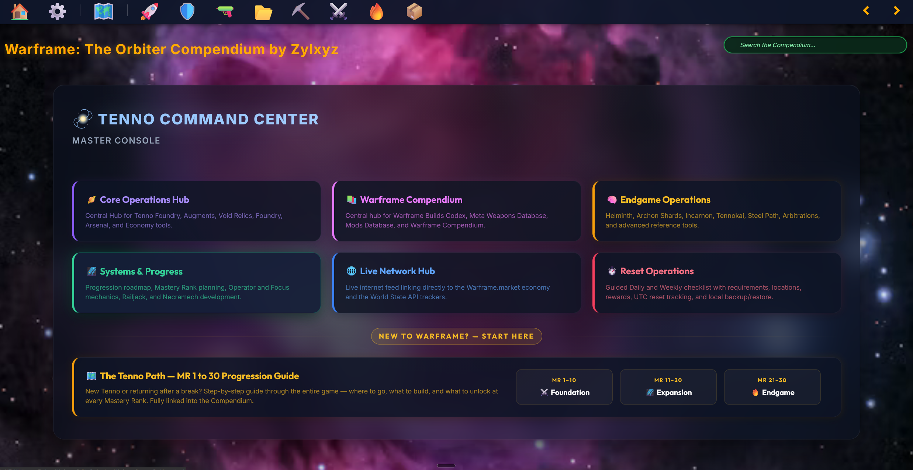
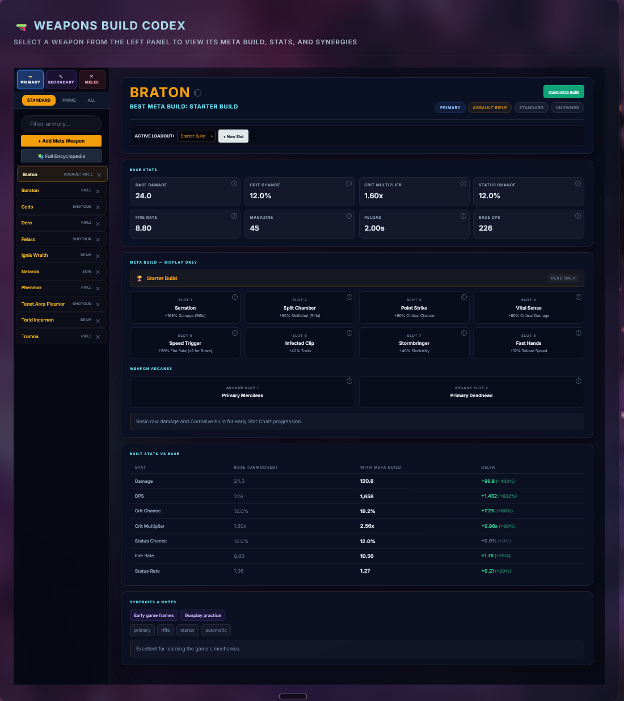
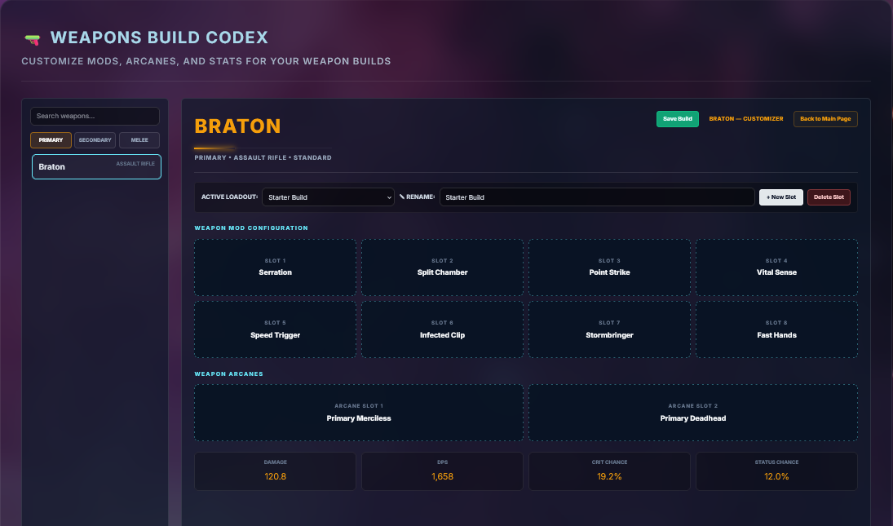
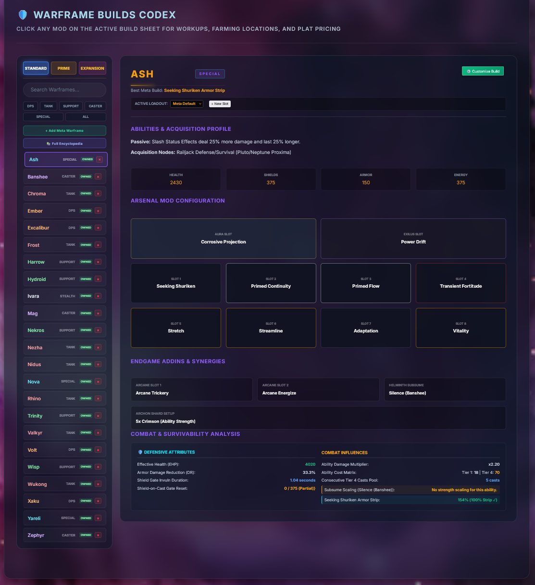
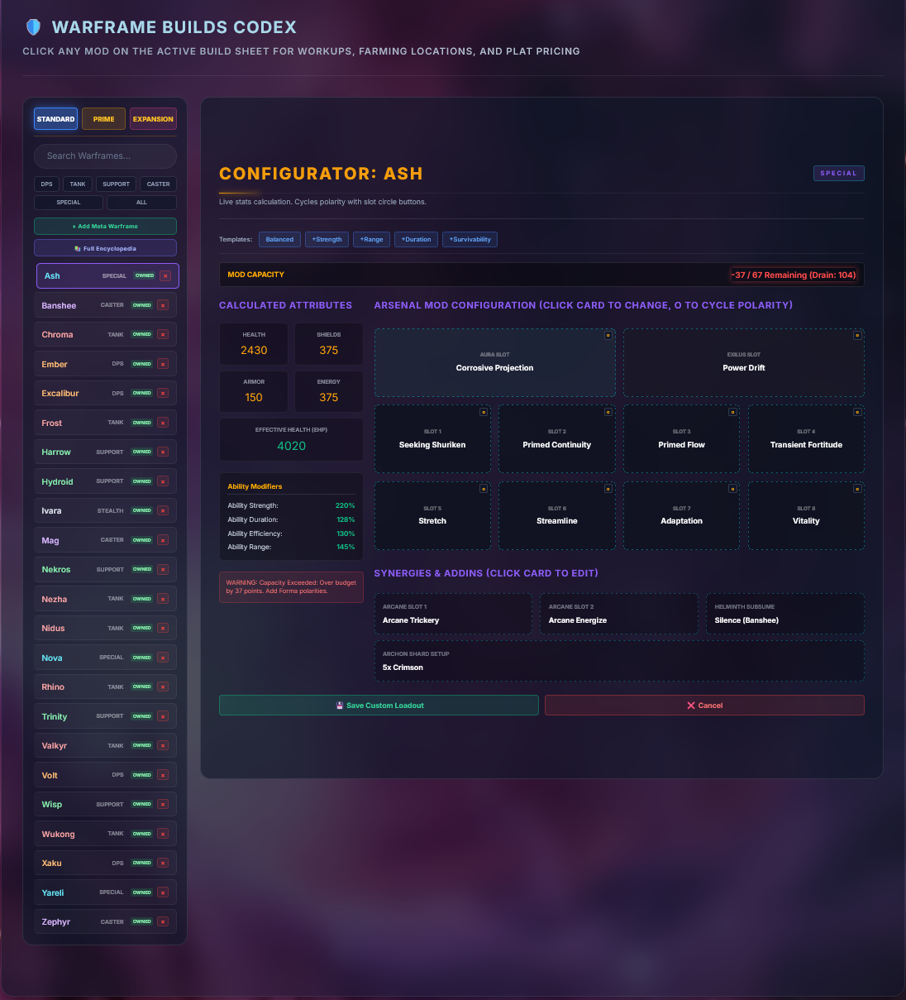
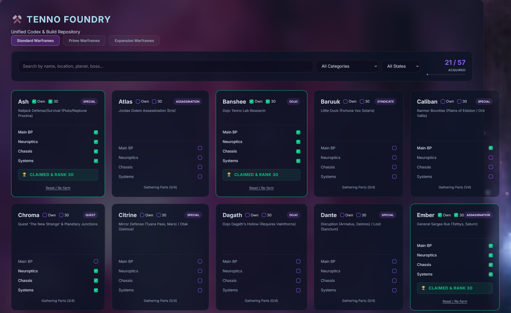
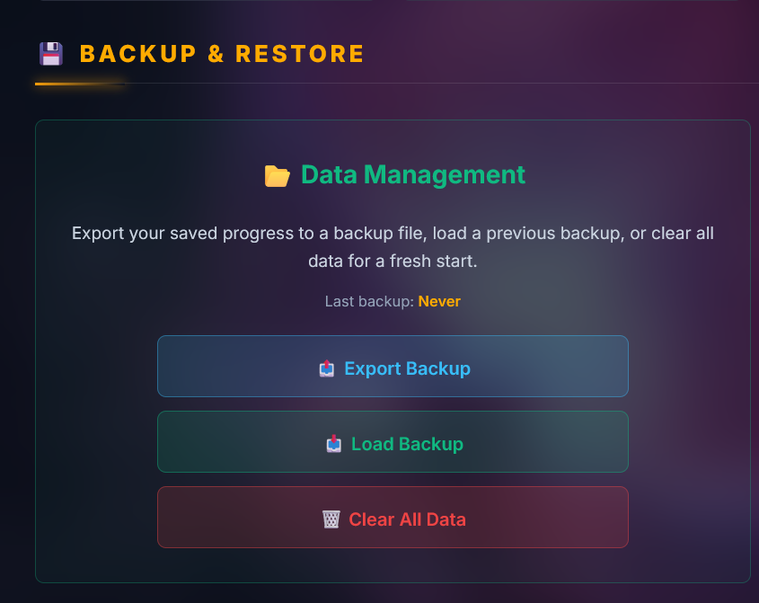

# 🪐 Warframe: The Orbiter Compendium

*by Zylxyz (Nelson Lesmerises)* · v1.28.0

A complete, offline-first Warframe reference and build companion — meta build codices, an interactive weapons database, a mods database, damage/status mechanics guides, progression roadmaps, and dozens of specialized trackers and calculators, all wrapped in one dark-glass, self-contained static site.

No server. No build step. No dependencies. No internet connection required once downloaded — open `!Warframe_Master_Index.html` and everything just works.

**🔗 [Try it live](https://nlesmerises.github.io/warframe-the-orbiter-compendium/)** — browse the whole Compendium in your browser right now, no download required.

## 📖 What it does

The Orbiter Compendium is a single-page-per-topic reference and build-tracking tool for Warframe. It replaces a stack of wiki tabs, spreadsheets, and community build guides with one self-contained site: look up any weapon, Warframe, mod, or mechanic; track what you own and what you're farming; and plan builds with live stat calculations — all running entirely in your browser, with nothing ever sent anywhere.

## ✨ Features

- **Meta Weapons Database** — live stat calculations, mod configurations, and build optimization for every weapon.

<table>
<tr>
<td width="50%"></td>
<td width="50%"></td>
</tr>
<tr>
<td><em>Meta build for every weapon — base stats, mod loadout, arcanes, and a full built-vs-base comparison table (damage, DPS, crit, status) computed live.</em></td>
<td><em>Full build customizer — rename loadouts, save multiple builds per weapon, and edit every mod/arcane slot with stats recalculating as you go.</em></td>
</tr>
</table>

- **Warframe Builds Codex** — interactive meta-build dashboard with custom loadouts and dynamic filtering.

<table>
<tr>
<td width="50%"></td>
<td width="50%"></td>
</tr>
<tr>
<td><em>Default meta build — full stats, mods, arcanes, and survivability analysis at a glance.</em></td>
<td><em>Customize any build — swap mods, cycle polarities, and see stats recalculate live.</em></td>
</tr>
</table>

- **Mods Database** — full 1,801-mod directory with search and category browsing.
- **Damage & Status Guide** — every damage type, proc, and faction matchup in one reference.
- **Progression Roadmap** — a phase-by-phase path from Mastery Rank 1 through The Steel Path.
- **Endgame tools** — Archon Shard planner, Incarnon tracker, Circuit tracker, and more.
- **Farming & Economy hub** — resource, relic, and platinum farming guides with live tooling.

*Tenno Foundry — track owned parts and farming progress for every Warframe, with claimed/rank-30 status per frame.*

- **Global search** — jump straight to any page, section, or entry across the whole Compendium.
- **Local backup & restore** — export your tracked data to a file and restore it later or on another machine.

## ⚙️ Settings

Available from the ⚙️ Settings page on every screen:

- **Player Profile** — in-game name, platform, and Mastery Rank, shown across the site.
- **Display Preferences** — UI scale, reduce-motion toggle, and number of search results shown.
- **Backup & Restore** — export or import all locally-saved data (loadouts, checkboxes, tracked progress) as a file.
- **Data Management** — view local storage usage and clear saved data if needed.

*Export your progress to a file any time, or load a previous backup — everything is stored locally, so this is also how you move your data to another machine.*

## ✅ Requirements

- Any modern web browser (Chrome, Firefox, Edge, Safari).
- No internet connection required after download — everything runs from local files.
- No installation, no runtime, no dependencies.

## 📥 Installation

1. Grab the latest release ZIP from [Releases](../../releases).
2. Extract it anywhere on your computer.
3. Open `!Warframe_Master_Index.html` in your browser.

That's the entire install process — there's nothing to build or configure to get it running.

## 🔧 Setup

The Compendium works immediately with no setup, but to get the most out of the tracking features:

1. Open **⚙️ Settings** and fill in your Player Profile (in-game name, platform, Mastery Rank).
2. Use the ownership checkboxes across the Warframes/Weapons/Mods pages to mark what you own — this drives the "active" filtering in the Builds Codex and Mods Database.
3. Periodically use **Backup & Restore** in Settings to export your data, especially before clearing browser storage or moving to a new machine.

## 🛠️ Development

Every page is plain HTML/CSS/JS — readable and editable directly, no build step required to run it locally. For contributors working on the source:

- `app/` is the active source tree; every page lives there (`app/docs/` for documentation pages).
- `app/assets/js/common.js` is the single source of truth for the shared header, navigation, search, and title banner — injected into every page rather than hand-copied.
- `preflight_check.py` runs a battery of consistency checks (dead links, encoding, version sync, nav sequence) — run before any release.
- `build_release.py` builds the distributable ZIP from source and refreshes the tested `current/` snapshot.
- Two changelogs are kept in sync on every release: `CHANGELOG.md` and `app/docs/Release_Notes.html`.

All personal data (loadouts, checkboxes, custom entries) is saved locally in your browser's storage — it stays on your machine and is never shared or uploaded anywhere.

## 📜 License & Attribution

**Warframe: The Orbiter Compendium**, created under the byline **Zylxyz**, is Copyright © 2026 Nelson Lesmerises. All rights reserved by the author except as expressly granted below.

You are free to **use, copy, modify, and redistribute** this project, in whole or in part, for any purpose, including commercially — provided that **credit to the original author (Nelson Lesmerises, byline Zylxyz) is retained in all copies and derivative works, under all circumstances.** Removing or omitting this attribution is not permitted.

This is a completely free, non-commercial, unofficial fan-made project. Warframe and all related logos, characters, names, graphics, and descriptions are trademarks and copyrights of **Digital Extremes Ltd** (or its licensors). This project is not affiliated with, sponsored by, authorized by, or associated with Digital Extremes in any capacity.

Full legal text, privacy disclosures, and fan-content policy: [`app/docs/License_Agreement.html`](app/docs/License_Agreement.html)

---

*Built and maintained by* **Zylxyz**
Community & contact: [Discord](https://discord.gg/rDc5DHt3G) · [GitHub](https://github.com/nlesmerises)
